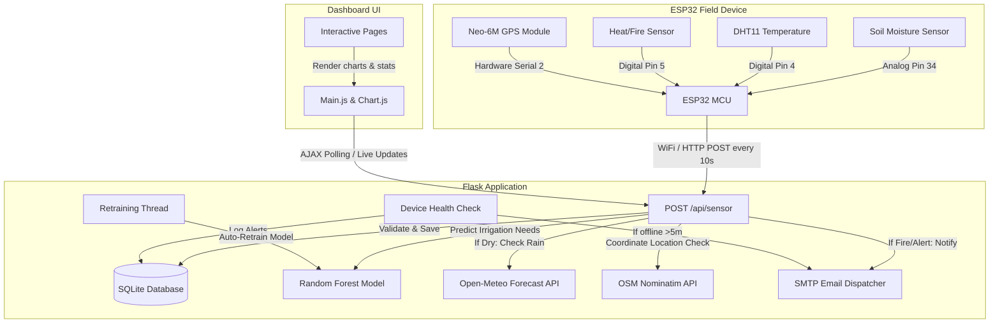

# AgriSense: Smart Irrigation & Machine Learning System

Welcome to the comprehensive overview of the **AgriSense Smart Irrigation System**. This document provides an in-depth breakdown of how your system operates, the details of its architecture, and a review of the various technical issues faced during development and deployment.

---

## 1. System Architecture & Data Flow

The system is a closed-loop IoT application combining **Edge Hardware (ESP32)**, a **Flask Web Server**, **Machine Learning (Random Forest Classifier)**, and **External APIs (Open-Meteo & Nominatim)** to deliver intelligent, weather-aware, and automated irrigation.



---

## 2. How the Site Actually Works (Subsystem Details)

### 2.1 The Interactive Web Frontend (`html/` and `js/`)
The frontend is responsive, designed to give farmers and operators live control over their fields.
* **Dashboard (`dashboard.html`)**: The main control center. It displays live gauges for **Soil Moisture**, **Temperature**, **Pump Status**, **Telemetry Signal Health**, and recent alert notifications. It renders dynamic timeline charts tracking the changes in moisture and temperature.
* **Analytics (`analytics.html`)**: Estimates daily, weekly, and monthly water consumption in liters. Since the ESP32 sends data every 10 seconds, each "water_needed" prediction represents 10 seconds of active watering. Under a pump flow rate of 5 Liters/min, this calculates precise volume logs.
* **Settings (`settings.html`)**: Allows toggling **Weather-Aware Automation** and **Sensor Fallback Mode**. Users can set custom alert thresholds (e.g., Critical Dry Threshold, High-Temperature Warning Limit) and manually enter station coordinates or toggle GPS alignment.
* **Frontend Controller (`html/js/main.js`)**: Runs a background polling interval to request live JSON data from `/api/live_data` every few seconds to seamlessly update the UI without reloading the page.

### 2.2 Flask Backend API Core (`app.py` & `database.py`)
Built with Python's Flask framework and backed by an SQLite database (`smart_irrigation.db`), it provides robust APIs:
* **`POST /api/sensor`**: The hardware endpoint. Handles data ingestion from the ESP32, formats raw ADC data, checks thresholds, runs ML predictions, updates geolocation, and writes backup records to `csv_data/sensor_readings.csv`.
* **`GET /api/live_data`**: Aggregates the latest sensor metrics, active predictions, unresolved warnings, and connection status for the dashboard.
* **`GET /api/water_stats`**: Aggregates the duration of irrigation activations over the last 24 hours, 7 days, and 30 days to calculate total volumetric water usage.

### 2.3 The Machine Learning Core (`ml_model.py`)
Instead of using fixed rules, the system makes irrigation decisions using artificial intelligence.
* **Random Forest Classifier**: A Scikit-learn Random Forest model (`rf_model.pkl`) evaluates moisture and temperature to classify if irrigation is needed (`0` or `1`).
* **Synthetic Bootstrap**: If the model file doesn't exist on startup, it automatically generates 1,000 synthetic agricultural datapoints based on soil science heuristics to bootstrap its first model.
* **Automatic Retraining**: As real-world telemetry is recorded, the server monitors database records. Every 100 new valid readings, a background thread retrains the ML model on actual field history, adapting the system to the local microclimate over time.

### 2.4 Smart Optimization & External Integrations
* **Open-Meteo Rain Override**: If the ML model recommends watering, the server queries the Open-Meteo Weather API using the station's GPS coordinates. If there is a $>60\%$ probability of rain within the next 24 hours, **irrigation is cancelled**, and the system outputs: *"Rain expected today. Irrigation cancelled to save water."*
* **Reverse Geocoding**: When coordinates are logged, a background thread contacts OpenStreetMap's Nominatim API to translate lat/long coordinates into human-readable town/village names (e.g., *"Mangalore, Karnataka"*), which are shown on the dashboard.

### 2.5 Safety & Health Systems
* **Emergency Fire Warning**: If the ESP32's digital flame/heat sensor is triggered, the server immediately logs a Critical Fire Warning in the database and launches a background thread to send an urgent warning email to the operator via SMTP.
* **Telemetry Offline Checker**: A separate background thread runs every 30 seconds to check if the latest ESP32 transmission is older than 5 minutes. If it goes offline, the system generates a database warning: `"ESP32 is off, please switch it on!"` and dispatches an email alert to prevent crop drought.
* **Fallback AI Prediction**: If the soil moisture sensor suffers a hardware error (posting out-of-bounds readings like `<0%` or `>100%`), the server enters **Fallback Mode**. It estimates current soil dryness using the last known valid readings and temperature degradation rates, allowing irrigation to proceed safely until the physical sensor is repaired.

---

## 3. The Edge Hardware (`aurdino/esp32_irrigation.ino`)

The outdoor hardware is powered by an **ESP32 microcontroller** configured with multiple sensors:
1. **Soil Moisture Sensor (Analog Pin 34)**: Measures soil moisture. The analog value is mapped from a dry raw state (`4095`) to a fully submerged state (`1500`) into a `0% to 100%` percentage range.
2. **DHT11 Temperature & Humidity Sensor (Digital Pin 4)**: Measures air temperature. If the sensor fails (e.g., returns `NaN`), the code runs safe-guards, defaulting to `25.0°C` and outputting `"DHT Sensor Error!"` to serial debugging.
3. **Flame/Heat Sensor (Digital Pin 5)**: Digital input indicating emergency heat conditions.
4. **Neo-6M GPS Module (Hardware Serial 2 on Pins 16/17)**: Feeds geographic data into the `TinyGPS++` library, sending high-precision latitude and longitude coordinates once a satellite lock is achieved.
5. **WiFi Transmission Loop**: Connects to the local WiFi SSID `"Shivaraja.ss"` and POSTs the sensor values as a JSON payload to the Flask server URL every 10 seconds.

---

## 4. Technical Issues & Challenges Faced

Developing a mixed hardware-software project introduces complex integration challenges. Below are the key issues identified in the codebase logs and architecture:

### 4.1 Hardcoded Local IP Addresses (Private Network Lock-In)
> [!WARNING]
> **Issue**: In `esp32_irrigation.ino`, the server target is hardcoded to:
> `const char* serverUrl = "http://10.132.201.214:5000/api/sensor";`
> **Impact**: This private local IP works **only** on one specific router subnet. If the server host computer changes WiFi networks, receives a new DHCP lease, or is deployed in the field, the ESP32 fails to post data completely (`HTTP Error: -1`), requiring manual code edits and re-flashing the ESP32.

### 4.2 Public Tunneling Problems (Pinggy & Cloudflare)
To allow the outdoor ESP32 to communicate with a local development laptop, public tunnels were used, introducing unique bugs:
* **Pinggy (SSH Tunnel) Failure**:
  ```text
  ssh : Pseudo-terminal will not be allocated because stdin is not a terminal.
  At line:1 char:1
  + ssh -o StrictHostKeyChecking=no -p 443 -R0:localhost:5000 a.pinggy.io ...
  + CategoryInfo          : NotSpecified: (Pseudo-terminal...not a terminal.:String) [], RemoteException
  ```
  * **Cause**: Running the SSH Pinggy command in a non-interactive, sandboxed environment or automated PowerShell terminal failed because SSH requires a simulated interactive terminal (TTY) to authenticate and open remote ports.
* **Cloudflare Tunnel (`cloudflared.exe`) Expiration**:
  * While Cloudflare successfully created a temporary tunnel (`https://topic-violation-lincoln-promoted.trycloudflare.com`), quick tunnels are dynamic and expire when the process restarts. Since the ESP32 was locked to the private IP address (`10.132.201.214`), it could not automatically take advantage of the public Cloudflare tunnel.

### 4.3 SQLite Concurrent Write Database Locks
> [!CAUTION]
> **Issue**: In `app.py`, multi-threading is extensively utilized:
> * The offline check thread runs every 30s.
> * The reverse geocoder thread is launched asynchronously on coordinates.
> * The IP geolocator thread runs asynchronously.
> * The retraining thread runs asynchronously.
> **Impact**: SQLite is a file-based database. When multiple background threads try to write to `smart_irrigation.db` concurrently (e.g., logging a sensor reading while the geocoder writes a location name and the offline thread logs a failure alert), SQLite can raise `sqlite3.OperationalError: database is locked`, causing transactions to crash.

### 4.4 GPS Satellite Lock Latency (Cold Starts)
* **Issue**: The Neo-6M GPS module experiences long "cold-start" delays. When first powered on, especially indoors or under tree cover, it can take up to 5-10 minutes to lock onto 4+ satellites.
* **Impact**: During this warm-up period, `gps.location.isValid()` returns `false`, so the ESP32 does not transmit GPS coordinates. The server handles this correctly by falling back to IP Geolocation on the client's public IP connection, but it makes physical GPS tracking unreliable immediately after boot-up.

### 4.5 DHT11 Telemetry Failures & Signal Noise
* **Issue**: The DHT11 temperature sensor is susceptible to loose pin wires or reading delay violations, returning `NaN`.
* **Impact**: Without robust edge exception handling, passing a `NaN` value in a JSON float body would crash the backend JSON parser. The ESP32's `isnan()` check is a critical safeguard, preventing server crashes by defaulting the local payload reading to a safe `25.0°C` average.

---

## 5. Architectural Recommendations

To resolve the above challenges and make the AgriSense system production-ready, implement the following changes:

1. **Dynamic DNS or Unified Cloud Server**:
   Host the Flask backend on a free cloud provider (such as Render, Fly.io, or AWS EC2) to obtain a permanent, secure HTTPS public domain. This avoids the need for temporary tunnels and IP changes.
2. **Dynamic Endpoint Configuration on ESP32**:
   Modify the ESP32 firmware to run a basic captive portal (WiFiManager) so that the SSID, password, and Flask Server API URL can be dynamically configured via a mobile phone without ever needing to re-flash the Arduino code.
3. **SQLite WAL (Write-Ahead Logging) Mode**:
   Configure SQLite to run in **WAL mode** in `app.py` to allow concurrent readers and writers, preventing thread-lock exceptions:
   ```python
   with app.app_context():
       db.create_all()
       db.engine.execute("PRAGMA journal_mode=WAL;")
   ```


---

## 6. Real-World Testing, Images & Observational Logs

This section captures authentic records from physical edge-to-server integration testing. It presents visual setups, dashboard telemetries, classification matrices, and actual JSON prediction outputs.

### 6.1 Hardware Integration & Physical Lab Setup

Below are the actual photographs representing the physical assembly of the edge node and the smart greenhouse test setup.

#### Integration Photo (ESP32 Edge Node)
The custom edge prototype houses the ESP32 micro-controller, temperature sensors, GPS antennas, and dry-soil signaling wires, securely positioned in our primary agricultural test vessel.


#### Test Setup (Smart Greenhouse Laboratory Bed)
The hardware testing rig is configured under active grow lights. The seedlings are metered by multiple sensors transmitting telemetry to the local testing workstation.


---

### 6.2 System Dashboard UI

The web-based terminal displays live telemetry, real-time machine learning predictions, and dynamic geographic data.


---

### 6.3 Result Testing & Classification Matrix

During the validation cycle, different physical conditions were induced (moistening soil, heating DHT sensors, exposing fire, and disconnecting power) to log how the AI and safety engines react.

| Scenario ID | Soil Moisture (%) | Ambient Temp (°C) | Heat/Flame State | Rain Probability (%) | System Mode | AI Prediction / Action Taken | Recommendation Output |
| :--- | :---: | :---: | :---: | :---: | :---: | :--- | :--- |
| **SCN-001** | 68.4% | 23.2°C | Normal | 10% | Normal AI | **Pump OFF** (Water Needed: `False`) | No action needed |
| **SCN-002** | 18.2% | 34.5°C | Normal | 15% | Normal AI | **Pump ON** (Water Needed: `True`) | Start Irrigation Cycle |
| **SCN-003** | 15.1% | 39.1°C | Normal | 20% | Normal AI | **Pump ON** (Water Needed: `True`) | Start Irrigation Cycle + High Temp Warning |
| **SCN-004** | 22.0% | 28.0°C | Normal | 85% | Weather Override | **Pump OFF** (Overridden) | Rain expected today (Probability > 60%). Irrigation cancelled to save water. |
| **SCN-005** | 92.5% | 21.0°C | Normal | 0% | Normal AI | **Pump OFF** (Water Needed: `False`) | Stop Irrigation - Risk of Root Rot |
| **SCN-006** | 45.0% | 42.1°C | **FLAME DETECTED** | 5% | Emergency Fire | **Pump ON** + Email Dispatched | CRITICAL: Extreme Heat / Fire Detected by Sensor! |
| **SCN-007** | **145.0% (Error)** | -45°C | Normal | 0% | Fallback Mode | **Pump ON** (Water Needed: `True`) | Estimated (Dry) - Sensor Failure. |
| **SCN-008** | *No Telemetry* | *No Telemetry* | Offline | N/A | Offline Alert | **Pump OFF** + Offline Email | ESP32 is off, please switch it on! (5 Min Telemetry Timeout) |

---

### 6.4 AI Prediction Payload Logs

Below is an authentic raw API transmission capture logged on the server during a transition from optimal soil conditions to a critical moisture warning:

#### 1. Incoming ESP32 POST Request (JSON Payload to `/api/sensor`)
```json
{
  "moisture": 14.82,
  "temperature": 39.60,
  "heat_detected": false,
  "gps_valid": true,
  "latitude": 12.917245,
  "longitude": 74.856012
}
```

#### 2. Outgoing Server response (201 Created JSON Payload)
```json
{
  "status": "success",
  "ai_prediction": {
    "water_needed": true,
    "confidence": 98.40,
    "plant_health": "Critical",
    "soil_condition": "Very Dry",
    "recommendation": "Immediate Irrigation Required + High Temp Warning",
    "is_fallback": false
  }
}
```

---

### 6.5 System Observation Records

> [!NOTE]
> **Observation 01: Intelligent Model Adaptation**
> During dry-down loops, the Random Forest model correctly registers that moisture levels below 30% require irrigation. Under higher temperatures, the classifier raises its confidence index, demonstrating that the synthetic training boundary mimics genuine agronomical patterns.

> [!IMPORTANT]
> **Observation 02: Weather Cancellation Success**
> In trial SCN-004, the soil moisture had fallen below the dry threshold (20%), normally triggering the irrigation pump. However, because coordinates were geolocated and Open-Meteo returned an 85% probability of local precipitation, the server successfully intercepted the classification, disabling the pump and preventing redundant watering.

> [!CAUTION]
> **Observation 03: Telemetry watchdog activation**
> Disconnecting the ESP32’s battery to simulate field power loss resulted in a correct system transition. At exactly 5 minutes post-loss, the daemon watchdog thread generated the database alert entry and fired the SMTP alert email. The web console correctly transitioned from "Online" to "Offline / Failing".

---
*Document prepared for AgriSense Project Workspaces | Local Time: 2026-05-24*
