# AgriSense End-to-End System Workflow (Detailed Reference Manual)

This document provides a highly detailed, component-level breakdown of the operational workflow of the **AgriSense Smart Irrigation System**. It covers the physical hardware wiring, edge firmware algorithms, Flask API design, database schemas, machine learning classifiers, weather forecast overrides, and real-time frontend updates.

---

## System Workflow Infographic


---

## Component Architectural Flow

```mermaid
flowchart TD
    %% Hardware Level
    subgraph Hardware [1. Edge Telemetry Nodes]
        SM[Capacitive Moisture Sensor] -->|Analog Out Pin 34| ESP32[ESP32 Microcontroller]
        DHT[DHT11 Temperature Sensor] -->|Digital Out Pin 4| ESP32
        Flame[Flame Sensor] -->|Digital Out Pin 5| ESP32
        GPS[Neo-6M GPS Module] -->|UART Serial Pins 16/17| ESP32
    end

    %% Network Transmission
    ESP32 -->|WiFi WPA2 | CF[Cloudflare Tunnel / pinggy]
    CF -->|HTTP POST JSON Payload| Flask[2. Flask Web API app.py]

    %% Ingestion and Storage
    subgraph Storage [3. Logging & Storage Layer]
        Flask -->|Serialize JSON| CSV[CSV File: csv_data/sensor_readings.csv]
        Flask -->|SQL INSERT| SQLite[(SQLite Database: smart_irrigation.db)]
    end

    %% Decision Core
    subgraph Brain [4. ML Decision Core & Optimization]
        Flask -->|moisture, temperature| ML[Random Forest Classifier]
        ML -->|Predict: water_needed| Weather{Weather Override Enabled?}
        Weather -->|Yes| OpenMeteo[Open-Meteo API]
        OpenMeteo -->|Precipitation Prob > 60%?| Cancel[Irrigation Bypassed]
        Weather -->|No / Low Rain Prob| Trigger[Irrigation Active]
    end

    %% Front-End Engine
    subgraph Dashboard [5. Client Frontend Engine]
        JS[main.js Polling Manager] -->|GET /api/live_data every 3s| Flask
        JS -->|GET /api/water_stats every 10s| Flask
        JS -->|GET /api/weather every 15s| Flask
        Flask -->|JSON Response| JS
        JS -->|Render Gauges & Charts| HTML[HTML Templates: base.html, dashboard.html]
    end
    
    style Hardware fill:#0d1527,stroke:#00d2ff,stroke-width:2px;
    style Storage fill:#0d1527,stroke:#00ff9d,stroke-width:2px;
    style Brain fill:#0d1527,stroke:#ff9f43,stroke-width:2px;
    style Dashboard fill:#0d1527,stroke:#ff4d4d,stroke-width:2px;
```



---

## 1. Edge Hardware & Telemetry Layer (`aurdino/esp32_irrigation.ino`)

The outdoor telemetry node consists of an **ESP32 MCU** wired to various sensors. It operates in a continuous loop to monitor agricultural parameters.

### 1.1 Hardware Specifications & Pin Connections
* **SS-01: Capacitive Soil Moisture Sensor (Pin 34)**:
  * Analog input mapping raw ADC voltages between `0` and `4095`.
  * Calibrated thresholds: Dry air state reads `4095`; fully submerged state reads `1500`.
  * Percentage Conversion Formula: 
    $$\text{Moisture \%} = \frac{4095 - \text{Raw Value}}{4095 - 1500} \times 100$$
* **SS-02: DHT11 Air Temperature Sensor (Pin 4)**:
  * Reads ambient greenhouse temperature using a single-wire digital protocol.
* **SS-03: Flame/Heat Sensor (Pin 5)**:
  * A digital input sensor that outputs `LOW` (0) under high heat/fire presence and `HIGH` (1) under normal conditions.
* **SS-04: Neo-6M GPS Module (Pins 16/17 - UART Serial 2)**:
  * Transmits standard NMEA strings to the ESP32 UART2 channel to parse latitude, longitude, and satellite locks via the `TinyGPS++` library.

### 1.2 Firmware Code Workflow
1. **SSID Association**: The ESP32 attempts a secure WPA2 connection to SSID `"Shivaraja.ss"`.
2. **Sensor Query**:
   * Reads raw analog values from the moisture sensor and maps them to a percentage range ($0\% - 100\%$).
   * Reads digital values from the DHT11 sensor. If it detects `NaN` (Sensor disconnected/noisy), it triggers error routines and sets a safe fallback value ($25.0^\circ\text{C}$) to prevent JSON packet corruption.
   * Scans UART serial buffer for GPS locks. If `gps.location.isValid()` is `true`, it extracts coordinate values; otherwise, it sends `gps_valid: false`.
3. **Payload Construction**:
   ```json
   {
     "moisture": 34.50,
     "temperature": 28.20,
     "heat_detected": false,
     "gps_valid": true,
     "latitude": 12.91724,
     "longitude": 74.85601
   }
   ```
4. **Transmission**: Opens an HTTP connection, sets the Content-Type header to `application/json`, and performs a `POST` request to `/api/sensor` on the server destination URL every 10 seconds.

---

## 2. Ingestion & Storage Layer (`app.py` & `database.py`)

The Flask backend is the ingestion pipeline, processing JSON telemetry, checking safety boundaries, and committing records to storage.

### 2.1 Ingestion Endpoint: `POST /api/sensor`
When a POST request hits the endpoint:
1. **Authentication & Structure Checks**: Validates that the payload contains required numeric keys (`moisture`, `temperature`). If keys are missing, it returns `400 Bad Request`.
2. **Backup Logging**: The raw data (with UTC timestamps) is appended to a local flat-file CSV at `csv_data/sensor_readings.csv` as an audit log.
3. **Location Processing**:
   * If `gps_valid` is `true`, the server compares coordinates. If they shift by $> 0.0001^\circ$ (~10m), it updates settings and starts a background thread to reverse-geocode coordinates using OpenStreetMap Nominatim.
   * If `gps_valid` is `false`, the server reads the HTTP request connection headers (CF-Connecting-IP, X-Forwarded-For, or remote address) and starts a background geolocation thread via `ip-api.com`.

### 2.2 Database Schema Design (`database.py`)
All inputs are written to `smart_irrigation.db` using **Flask-SQLAlchemy**:

* **`User` Table**: Holds farmer login profiles.
  * Columns: `id`, `name`, `email`, `password_hash` (Werkzeug Security hash), `created_at`.
* **`SensorReading` Table**: Keeps historical logs of edge telemetry.
  * Columns: `id`, `timestamp` (UTC), `moisture` (float), `temperature` (float), `valid_reading` (boolean).
* **`PredictionHistory` Table**: Logs all decisions generated by the ML core.
  * Columns: `id`, `timestamp`, `water_needed` (boolean), `plant_health` (string), `soil_condition` (string), `recommendation` (string), `is_fallback_mode` (boolean).
* **`Alert` Table**: Tracks unresolved system/environmental alarms.
  * Columns: `id`, `timestamp`, `message` (string), `alert_type` (string), `resolved` (boolean).

---

## 3. Decision Core & ML Retraining (`ml_model.py`)

Instead of standard heuristic logic, AgriSense utilizes a **Random Forest Classifier** to assess whether irrigation is required based on moisture and temperature variables.

### 3.1 Bootstrap & Model Loading
* On startup, the machine learning module checks for the presence of the model file `rf_model.pkl`.
* If it is missing, the system runs a synthetic bootstrap routine. It generates 1,000 mock data points based on crop-science boundaries (e.g. moisture $<30\%$ and temperature $>30^\circ\text{C}$ requires watering), fits a Scikit-Learn `Random Forest Classifier`, and saves it as `rf_model.pkl`.

### 3.2 Dynamic In-Database Retraining
* To adapt to local microclimates, the system monitors the database.
* Every 100 new valid sensor readings logged in `smart_irrigation.db`, a background thread fetches the last 500 records and retrains the model. This updates the classification boundaries automatically.

### 3.3 Open-Meteo Integration (Rain Override)
If the Random Forest classifier determines that `water_needed = True`:
1. The server checks if the weather automation toggle is enabled in settings.
2. It makes an HTTP request to the Open-Meteo API using the node's latitude and longitude:
   `https://api.open-meteo.com/v1/forecast?latitude={lat}&longitude={lon}&hourly=precipitation_probability&forecast_days=1`
3. If the maximum hourly precipitation probability for the next 24 hours is **above 60%**, the server overrides the decision, setting `water_needed = False`, logging a `Weather Override` event, and saving the recommendation: 
   *"Rain expected today (Probability > 60%). Irrigation cancelled to save water."*

---

## 4. Frontend Dashboard Engine (`main.js` & `base.html`)

The frontend is a responsive web application that displays real-time telemetry, charts, and system status logs.

### 4.1 UI Component Architecture
* **Dashboard Gauges** (See *Image 3: Live Telemetry Analytics Dashboard*):
  * **Crops 1 Gauge**: Live interactive SVG indicator showing current moisture. It changes color dynamically (Cyan/Green for optimal, Orange/Red for dry).
  * **Orchard 2 & Garden 3 Cards**: Display inactive/unconfigured overlay states when online, preventing false readings.
* **Timeline Charting**:
  * Utilizes **Chart.js** to draw a line chart of temperature readings. 
  * Only valid, live telemetry points are plotted. The chart maintains a maximum of 10 coordinates to prevent rendering lag.

### 4.2 Dynamic AJAX Polling Controllers
When `/dashboard` is loaded, the frontend initialization scripts trigger background interval polling:
* **Live Telemetry Interval (Every 3 seconds)**:
  * Polls `/api/live_data` to get the latest JSON values from `SensorReading` and `PredictionHistory`.
  * If a reading is not received within 5 minutes, the interface displays an offline alert banner, changes the system health indicator to `Offline`, and triggers a native browser desktop notification.
  * Dynamically populates the *AI Prediction Status Log* panel on the dashboard.
* **Water Stats Interval (Every 10 seconds)**:
  * Polls `/api/water_stats` to get water consumption statistics. 
  * Displays estimated water usage (in liters) for the past 24 hours, 7 days, and 30 days based on irrigation activation durations.
* **Weather Data Interval (Every 15 seconds)**:
  * Polls `/api/weather` to retrieve the current weather conditions, forecast summaries, rain probabilities, and location details.

---

> [!IMPORTANT]
> **Safety Watchdog Alerting**
> The system has a dedicated background thread running every 30 seconds to check if the latest sensor reading timestamp is older than 5 minutes. If it is, the thread logs a sensor failure alert in the database and dispatches an emergency warning email to the operator via SMTP.
